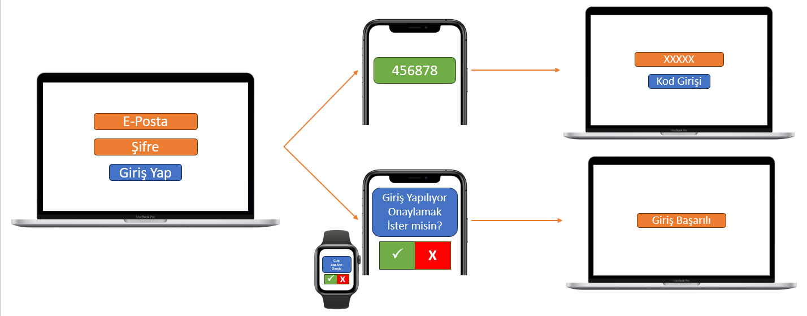

# 🔐 İki Faktörlü Kimlik Doğrulama (2FA)

Hesaplarınıza çevrimiçi olarak giriş yaptığınızda, bunu yapmak için çoğunlukla basit bir 'kullanıcı adı ve şifre' kombinasyonu kullanırsınız. Oturum açma işleminize iki faktörlü kimlik doğrulama (2FA) eklemek, hesaplarınıza ekstra bir güvenlik katmanı eklemenin basit bir yoludur.

Bir kullanıcı adı ve şifre oturum açma methoduna güvenmenin sorunu, şifrenizi her zaman güvende tutulamamasıdır. 2FA ile başka bir güvenlik düzeyi eklemek, bir saldırganın çevrimiçi hesaplarınıza erişmesini zorlaştırır - yalnızca şifrenizi bilmek hesaba giriş için yeterli değildir.

<figure><figcaption></figcaption></figure>

### 2FA Nasıl çalışır

Bir kullanıcı adı ve şifre ile bir hesaba giriş yaptığınızda, tek faktörlü kimlik doğrulama denilen şeyi kullanırsınız. Söylediğiniz kişi olduğunuzu doğrulamak için tek bir şeye ihtiyacınız var - **şifreniz**.

2FA ile, bir hesaba erişmeden önce iki şey sağlamanız gerekir - **şifreniz ve başka bir şey**.

Diğer şey ise temelde bunlardır,

* Bildiğin bir şey
  * başka bir şifre, güvenlik soruların cevapları, PIN numarası
* Sahip olduğun bir şey
  * USB token, güvenlik kartı, bir doğrulama yazılımı, anahtar
* Olduğun bir şey
  * parmak izi, retna/iris taraması, ses tanıması, yüz tanıması

Turkcell üzerinden örnek vermek gerkirse, şirket VPN'i 2FA kullanmaktadır ve şifre girdikten sonra SMS kodu gelmektedir.

### Neden 2FA Kullanmalıyım?

Şifrenizin çalınması ya da sızdırılması durumunda hesabınızı koruyabilecek bir sistemdir. Saldırganlar 2FA olmayan hesaplara direk giriş yapabilecek, 2FA'sı olan sistemlere özel kodlara erişimi olmadığı için giriş yapamayacaktır.

Önemli gördüğünüz tüm hesaplarınıza 2FA açmanızı şiddetle tavsiye ederiz. E-Mail'iniz, Finansal Hesaplarınız, E-Devlet gibi önemli olabilecek hesaplarda olmasını tavsiye ederiz.

### 2FA Tipleri

Bir sistemde 2FA'yı açtığınız taktirde genelde iki farklı seçenek ile karşı karşıya gelirsiniz. Bunlar SMS veya Authenticator uygulamalarıdır.

* SMS Şirketler tarafından en çok kullanılan 2FA yöntemidir. Kullanmak için şirket telefon numaranızı talep edecektir.
* Authenticator uygulamaları telefon, tablet veya bilgisayarınıza kurduğunuz bir uygulamadır. Google Authenticator, Authy ve Microsoft Authenticator en çok kullanılanlar arasındadır. Kod üretimi cihazınızın üzerinde yapıldığı için SMS gibi teflonunuzun bağlantıya ihtiyacı yoktur ve SMS'in gelmesini beklemenize gerek yoktur.
* E-Mail SMS'den sonra en çok kullanılan yöntemdir ancak mailinize izinsiz erişim olması sonrası 2FA kodunuza erişim sağlanabileceği için çok tercih edilmez. Çoğunlukla telefon numaranızı vermediğiniz zaman otomatik olarak kullanılır.

Ek olarak 2FA açılırken kullandığınız ürün, yedek kodlar verir. Bu kodların her birisi sadece bir defa kullanılabilir ve 2FA koduna erişim sorunu olduğu zaman ya da telefonunuzu kaybettiğiniz ya da ulaşamadığınız gibi acil durumlarda kullanılmak için verilir.

### 2FA yok ise ne yapmalıyım?

Son zamanlarda 2FA ürünlerin çok büyük çoğunluğunda kullanılabilir hale gelmiştir ancak 2FA kullandığınız ve kullanmak isteğiniz üründe yok ise yapılabilecek şeyler şunlardır,

* Kullandığınız ya da kullanmak istediğiniz servisi 2FA olan alternatif bir ürün ile değiştirmeyi düşünmelisiniz.
* Ürünü yapan firmaya bu talebinizi iletebilirsiniz ve geliştirilmesini isteyebilirsiniz.
* Kuvvetli bir şifre kullanmak isteyeceksiniz, daha fazla bilgi için [iyi-bir-sifre-nasil-olusturulur.md](iyi-bir-sifre-nasil-olusturulur.md "mention") dokümanımıza bakabilirsiniz.
