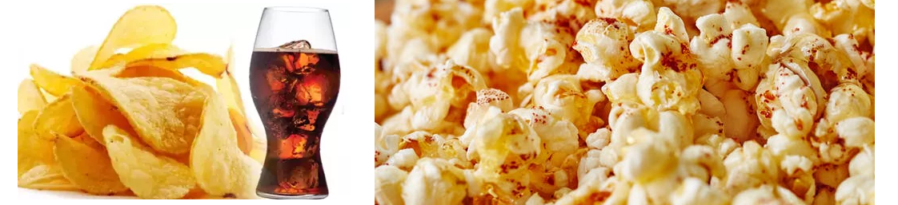

# 🗝 İyi Bir Şifre Nasıl Oluşturulur?

### Şifrenizi uzun ve güçlü yapın

Uzun şifreler güçlü şifrelerdir. İyi bir şifre oluşturmanın kolay bir yolu, dört veya daha fazla rastgele kelimeden oluşan bir şifre oluşturmaktır. Şifreleri hatırlamak yalnızca daha kolay olmakla kalmaz, aynı zamanda uzun bir sayı, harf ve simge karışımı kullanan bir parola kadar güçlüdür.

Size özel bir cümle, etrafınızdaki eşyalar veya eğlenceli bir ifade olan bir parola yapmayı deneyebilirsiniz. <mark style="color:red;">**Ancak**</mark> daima size rastgele gelen sözcükleri kullanın. Aile adlarını, doğum tarihlerini veya adresleri kullanmaktan kaçının. Bu tür bilgileri insanların bulması kolaydır.

<figure><figcaption></figcaption></figure>

* Örneğin, <mark style="color:blue;">**Tereyağlıpatlamışmısır**</mark> veya <mark style="color:blue;">**Alaturkacipsvekola**</mark>, <mark style="color:blue;">**YeşilçayveBiskuvi**</mark>
  * <mark style="color:green;">**Bu tür şifreler en az karmaşık şifreler kadar güvenlidir.**</mark>

### Parolalarınızı oluşturmak için kişisel bilgileri kullanmayın

Sosyal medya kullanıyorsanız, kişisel bilgilerinizin bulunması baya kolaydır. Doğum tarihiniz, adresiniz ve hatta evcil hayvanınızın adı gibi sizinle ilgili ayrıntılar saldırganların, hesaplara girmeye çalışırken kontrol ettikleri ilk şey olacaktır. Örneğin kediniz Alex hakkında bir paylaşım yapıyorsanız. Şifreniz içinde Alex olmamalı.

### Geleneksel şifre oluşturma yolları

* Suçluların kolayca tahmin edebileceği en yaygın şifrelerden kaçının ('passw0rd' gibi)
* Önemli hesaplarda aynı şifreyi tekrar kullanmayın. Parolalarınızdan biri çalınırsa, suçlunun (örneğin bankacılık hesabınıza da erişmesini istemezsiniz.
* Ek olarak normalde şifrenizi <mark style="color:orange;">**Canımoğlum**</mark> yapmak istiyorsanız, burada **I** harfi yerine **1**, **L** harfi yerine **!** kullanılabilir. Şifreniz nihai olarak "<mark style="color:blue;">**Can1moğ!um**</mark>**"** olacaktır. Bu şekilde komplike bir şifre oluşturmuş olacaksınız.
* Rastgele dört kelimeden oluşan şifreler, en az 10 karakter olacak şekilde ve rakam, büyük küçük harfler, noktalama ve semboller ile yapılan şifreler kadar güvenlidir. İsteğinize göre kullanabilirsiniz.
